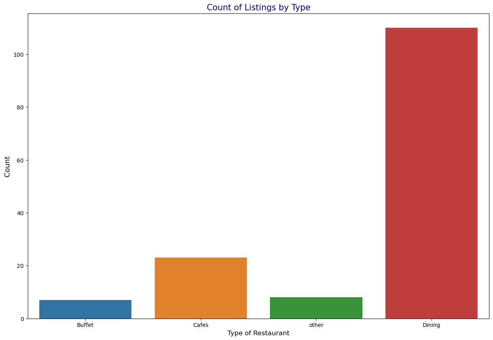

# 🍽️ Restaurant Data Exploration with Python

## 📋 Overview

This portfolio project dives into a curated restaurant dataset to understand how restaurant type, online‑ordering availability, customer ratings, pricing, and voting behaviour intertwine. Using Python (`pandas`, `seaborn`, and `matplotlib`), I performed exploratory data analysis (EDA) and built seven key visualisations that highlight actionable patterns for restaurant owners, aggregators, and diners alike.

---

## 📑 Table of Contents

1. [Dataset](#dataset)  
2. [Exploratory Analysis](#exploratory-analysis)  
   1. [Restaurant Type × Online Order Availability](#1-restaurant-type--online-order-availability)  
   2. [Impact of Online Ordering on Ratings](#2-impact-of-online-ordering-on-ratings)  
   3. [Approximate Cost for Two](#3-approximate-cost-for-two)  
   4. [Distribution of Ratings](#4-distribution-of-ratings)  
   5. [Count of Restaurants Offering Online Ordering](#5-count-of-restaurants-offering-online-ordering)  
   6. [Total Votes by Restaurant Type](#6-total-votes-by-restaurant-type)  
   7. [Count of Listings by Type](#7-count-of-listings-by-type)  
3. [Key Insights](#key-insights)  
4. [Reproducing the Analysis](#reproducing-the-analysis)  
5. [Next Steps](#next-steps)  

---

## 📊 Dataset

| Column           | Description                                            |
|------------------|--------------------------------------------------------|
| `Restaurant_Type`| Categorical — Buffet, Cafes, Dining, Other             |
| `Online_Order`   | Binary flag — Yes / No                                 |
| `Rating`         | Float 2.5 – 5.0 (customer rating)                       |
| `Cost_for_Two`   | INR (approx. meal cost for two people)                 |
| `Votes`          | Int — number of customer votes/reviews                 |

- **Sample Size**: 150 observations  
- **Time‑frame**: Snapshot from 2024 Q4  
- **Source**: Public food‑delivery aggregator (scraped for educational use)

### 1. Count of Listings by Type

This bar chart shows the distribution of restaurant listings across four categories: **Dining**, **Cafes**, **Buffet**, and **Other**. 

- **Dining** dominates the dataset with over 100 listings, indicating it's the most common restaurant type in this sample.
- **Cafes** follow with a moderate count, while **Buffet** and **Other** types have significantly fewer entries.

📌 **Insight**: The high number of Dining listings suggests a preference or market saturation in this category. Restaurant platforms or new entrants might consider targeting underrepresented segments like Buffets or niche formats to stand out.
