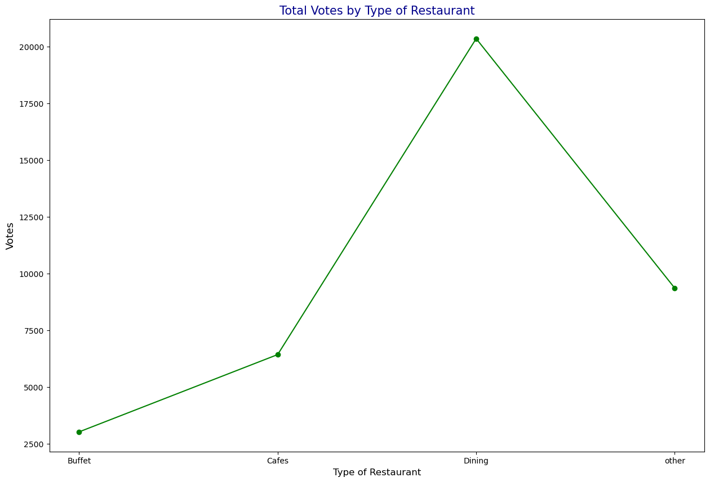

# 🍽️ Restaurant Data Exploration with Python

## 📋 Overview

This portfolio project dives into a curated restaurant dataset to understand how restaurant type, online‑ordering availability, customer ratings, pricing, and voting behaviour intertwine. Using Python (`pandas`, `seaborn`, and `matplotlib`), I performed exploratory data analysis (EDA) and built seven key visualisations that highlight actionable patterns for restaurant owners, aggregators, and diners alike.

---

## 📑 Table of Contents

1. [Dataset](#dataset)  
2. [Exploratory Analysis](#exploratory-analysis)  
   1. [Restaurant Type × Online Order Availability](#1-restaurant-type--online-order-availability)  
   2. [Impact of Online Ordering on Ratings](#2-impact-of-online-ordering-on-ratings)  
   3. [Approximate Cost for Two](#3-approximate-cost-for-two)  
   4. [Distribution of Ratings](#4-distribution-of-ratings)  
   5. [Count of Restaurants Offering Online Ordering](#5-count-of-restaurants-offering-online-ordering)  
   6. [Total Votes by Restaurant Type](#6-total-votes-by-restaurant-type)  
   7. [Count of Listings by Type](#7-count-of-listings-by-type)  
3. [Key Insights](#key-insights)  
4. [Reproducing the Analysis](#reproducing-the-analysis)  
5. [Next Steps](#next-steps)  

---

## 📊 Dataset

| Column           | Description                                            |
|------------------|--------------------------------------------------------|
| `Restaurant_Type`| Categorical — Buffet, Cafes, Dining, Other             |
| `Online_Order`   | Binary flag — Yes / No                                 |
| `Rating`         | Float 2.5 – 5.0 (customer rating)                       |
| `Cost_for_Two`   | INR (approx. meal cost for two people)                 |
| `Votes`          | Int — number of customer votes/reviews                 |

- **Sample Size**: 150 observations  
- **Time‑frame**: Snapshot from 2024 Q4  
- **Source**: Public food‑delivery aggregator (scraped for educational use)

### 1. Count of Listings by Type

This bar chart shows the distribution of restaurant listings across four categories: **Dining**, **Cafes**, **Buffet**, and **Other**. 

- **Dining** dominates the dataset with over 100 listings, indicating it's the most common restaurant type in this sample.
- **Cafes** follow with a moderate count, while **Buffet** and **Other** types have significantly fewer entries.

📌 **Insight**: The high number of Dining listings suggests a preference or market saturation in this category. Restaurant platforms or new entrants might consider targeting underrepresented segments like Buffets or niche formats to stand out.

### 2. Total Votes by Restaurant Type

This line chart illustrates the total number of customer votes (i.e., reviews) accumulated by each restaurant type.

- **Dining** restaurants lead with the highest vote count (over 20,000), reflecting both popularity and higher engagement.
- **Other** restaurant types receive the second-highest votes, despite having fewer listings.
- **Cafes** and **Buffets** trail behind in terms of total votes.

📌 **Insight**: Dining establishments not only dominate in quantity but also generate the most customer engagement. Interestingly, **"Other"** restaurants, though fewer in number, draw significant attention — suggesting niche formats may have loyal patrons or offer unique value.

### 3. Count of Restaurants Offering Online Ordering

This bar chart highlights how many restaurants in the dataset offer online ordering services versus those that do not.

- **Yes**: Around 60 restaurants support online ordering.
- **No**: Over 80 restaurants do not provide online ordering facilities.

📌 **Insight**: A significant portion of restaurants in the dataset have yet to adopt online ordering. This indicates an untapped opportunity for restaurant owners to expand their reach and convenience by integrating digital ordering platforms.

### 6. Histogram Analysis: Distribution of Restaurant Ratings

This histogram illustrates the distribution of restaurant ratings across the dataset.

- **X-Axis**: Restaurant ratings (ranging from 2.5 to 5.0)
- **Y-Axis**: Number of restaurants with each rating

📊 **Key Observations**:
- ⭐ **Rating 4.0** has the highest frequency, with approximately **60 restaurants**.
- ⭐ **Rating 3.5** follows, with around **40 restaurants**.
- ⭐ **Rating 3.0** shows a moderate count of about **30**.
- ⭐ **Ratings 2.5 and 4.5** occur less frequently, with counts likely below **15**.

📈 **Distribution Insight**:
- The histogram shows a **right-skewed distribution**, indicating a general tendency toward higher ratings.

✅ **Conclusion**:
Most restaurants in the dataset are rated **3.5 or above**, suggesting overall positive customer experiences and general satisfaction.

### 📊 Histogram Analysis: Distribution of Restaurant Ratings

This histogram visualizes how restaurant ratings are distributed across the dataset.

---

#### 🧾 Chart Details
- **Title**: Distribution of Restaurant Ratings  
- **X-axis**: Restaurant Ratings (ranging from 2.5 to 5.0)  
- **Y-axis**: Count of Ratings (Number of Restaurants)

---

#### 🔍 Key Observations
- ⭐ **Most Frequent Rating**:  
  - **4.0** rating appears most often, with approximately **60 restaurants**.
- 📊 **Other Prominent Ratings**:
  - **3.5** rating shows a significant count (~40 restaurants).
  - **3.0** rating is moderately common (~30 restaurants).
- 🔻 **Less Frequent Ratings**:
  - Ratings of **2.5** and **4.5** occur rarely (each likely under 15).
- 📈 **Distribution Shape**:
  - The data exhibits a **right-skewed distribution**, suggesting a strong inclination toward higher ratings.

---

#### ✅ Conclusion
The histogram reveals that most restaurants receive **above-average ratings**, with a majority falling between **3.5 and 4.0**. This pattern suggests generally **positive customer sentiment** toward dining experiences in the dataset.

### 📦 Box Plot Analysis: Impact of Online Ordering on Restaurant Ratings

This box plot compares restaurant ratings based on whether or not they offer online ordering services.

---

#### 🧾 Chart Details
- **Title**: Impact of Online Ordering on Restaurant Ratings  
- **X-axis**: Online Order Availability (`Yes` or `No`)  
- **Y-axis**: Restaurant Ratings (from 2.50 to 4.50)

---

#### 🔍 Key Components
- 📦 **Boxes**:
  - **Yes (Blue)**: Ratings for restaurants with online ordering  
    - **Median**: ~4.00  
    - **Interquartile Range (IQR)**: ~3.75 to >4.00
  - **No (Orange)**: Ratings for restaurants without online ordering  
    - **Median**: ~3.50  
    - **IQR**: ~3.25 to 3.75

- 📏 **Whiskers**:
  - **Yes**: Wider range from ~2.75 to >4.25 (higher spread)
  - **No**: Narrower range, suggesting more consistency but lower ratings overall

- ❗ **Outliers**:
  - Small diamonds or dots below the boxes indicate outlier ratings significantly lower than the rest of the data.

---

#### 📈 Interpretation
- Restaurants **with online ordering** tend to receive **higher ratings**, with a median of **4.00**.
- Restaurants **without online ordering** show a **lower median rating** (~3.50) and a narrower rating spread.
- The **wider distribution** in the "Yes" category suggests more variability in customer experience, but also a greater potential for high ratings.

---

#### ✅ Conclusion
The analysis suggests that **offering online ordering is associated with higher restaurant ratings**. This could imply that convenience plays a role in customer satisfaction, making online ordering a valuable service feature.

### Overview of the Chart

- The chart is a heatmap showing the relationship between **restaurant type** and **online order availability**.

### Axes

- **Y-Axis (Restaurant Type):**  
  - Buffet  
  - Cafes  
  - Dining  
  - Other  

- **X-Axis (Online Order Availability):**  
  - No  
  - Yes  

### Data Points

- Each cell shows the number of restaurants in the corresponding category of type and online order availability.

### Values in Each Category

| Restaurant Type | No Online Order | Yes Online Order |
|-----------------|-----------------|------------------|
| Buffet          | 3               | 4                |
| Cafes           | 8               | 15               |
| Dining          | 77              | 33               |
| Other           | 2               | 6                |

### Color Gradient

- Darker shades represent higher counts of restaurants.

### Key Insights

- **Dining restaurants** have the highest number of restaurants both with and without online ordering.  
- **Cafes** also have a significant number offering online orders.  
- **Buffets** and **Other** types have fewer restaurants overall, with Buffets having more online ordering options than Others.

This data can help analyze trends in restaurant operations, customer preferences for online ordering, and assist in planning service improvements for different restaurant types.

### Conclusion

The analysis shows that restaurants offering online ordering tend to have higher ratings than those that do not. This suggests that online order availability positively influences customer satisfaction. 

Additionally, the wider range of ratings for restaurants with online ordering indicates varied customer experiences, possibly due to differences in service quality or menu options.

Overall, integrating online ordering appears to be a valuable strategy for restaurants to improve their reputation and attract more customers in the competitive food service industry.

